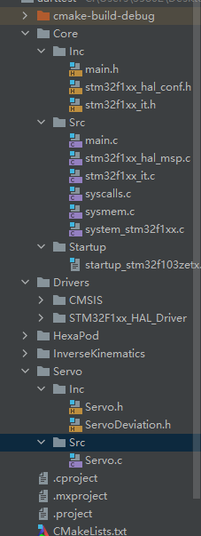

# Robogame-Hexapod-电控手册

---

本手册主要记录Robogame 球形六足机器人项目的电控进度，电控细节/原理说明等。

---

## 电控进度

- [x] 底层舵机控制函数
- [x] 逆运动学/正运动学相关函数
- [x] 复合动作实现
- [ ] 上位机蓝牙控制器
- [ ] 整体调试

---

## 电控原理

原理详见[计划书控制部分说明](Project Proposal\RoboGame.pdf)

---

## 电控细节概述:

### 硬件：

#### 主要硬件包含：串行舵机，舵机控制板，7.4V电源，STM32F103ZET6单片机，JDY-31蓝牙串口模块.

#### 连接控制逻辑：

Hexapod主要由30个串行总线舵机，通过以7.4V的电源驱动的舵机控制板控制，**至多能串行连接4个舵机**.

由STM32F103ZET6作为上位机，通过串口对舵机控制板进行控制.

同时由JDY-31通过串口连接单片机，由蓝牙可以通过串口与单片机进行通信.

#### 连接图：

### 主要引脚连接:

STlink烧录/调试器:**PA13(SWDIO)**,**PA14(SWCLK)**

JDY-31蓝牙串口通信:**PA2(TX)**,**PA3(RX)**

串行舵机控制串口: **PB10(TX)**,**PB11(RX)**

### 软件：

#### 涉及到的技术点:

串口通信(蓝牙串口、舵机串口)，中断处理

#### 环境：

使用STM32CubeMX生成代码模板，使用Clion+OpenOCD+MinGW+GDB进行下载，编译，调试.

#### 结构:

核心部分:

Drivers:板卡自带的一些计时器/硬件资源库，(可无视)

Core:主要程序所在，需要使用到的部分为main(主程序)和stm32f1xx_it(中断处理相关)

Servo:包含针对舵机一些操作的底层库

HexaPod:上层控制函数

InverseKinematics:逆运动学计算函数

---

## 进度信息表

- 8.1 逆运动学/坐标转化完成

